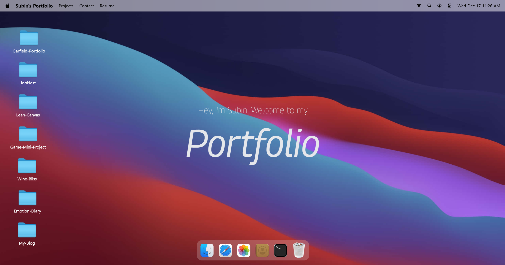
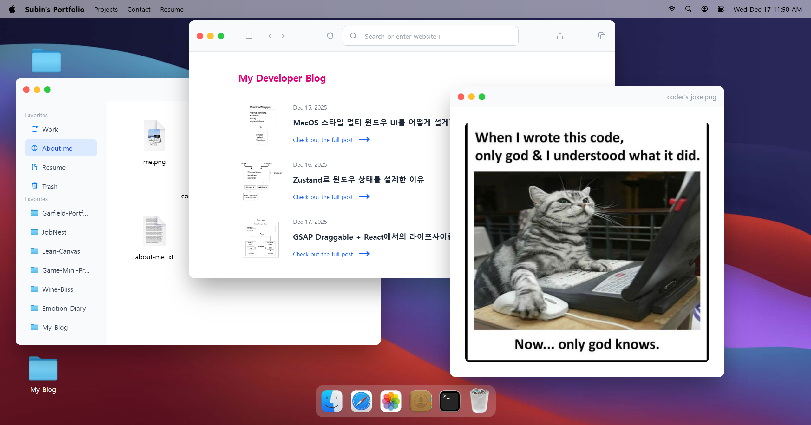

# MacOS-Portfolio 💻

This is an interactive portfolio that recreates the macOS desktop environment on the web. The goal was to implement the functionalities of a real desktop operating system—such as a multi-window system, dragging, focus management, and z-index handling—in a web UI, rather than creating a simple, static introductory page. Individual applications like Finder, Safari, Terminal, Photos, Resume, and Contact all operate as independent windows and can be launched and closed via the Dock.

Users can explore the portfolio by moving, stacking, and switching focus between windows, simulating the experience of using a real macOS desktop.

## ✨ Features

| Feature                         | Description                                                            |
| ------------------------------- | ---------------------------------------------------------------------- |
| **MacOS 스타일 멀티 윈도우 UI** | MacOS처럼 여러 창을 동시에 열고 이동·포커싱할 수 있는 데스크톱 UI 구현 |
| **윈도우 드래그 이동**          | GSAP Draggable을 사용해 자연스러운 창 이동 구현                        |
| **포커스 관리**                 | 클릭 시 해당 창이 최상단(z-index)으로 올라오도록 처리                  |
| **Dock 기반 앱 실행**           | macOS 스타일 Dock을 통해 앱 실행 및 접근                               |
| **앱 열기 / 닫기**              | Dock 및 컨트롤 버튼을 통해 윈도우 상태 제어                            |
| **파일 타입별 처리**            | txt, img, pdf, url 등 파일 타입에 따라 다른 동작 수행                  |
| **이미지 뷰어**                 | 이미지 파일 클릭 시 전용 이미지 윈도우로 표시                          |
| **PDF 이력서 뷰어**             | react-pdf를 활용한 이력서 미리보기 및 다운로드                         |
| **반응형 기본 대응**            | 데스크톱 환경 최적화, 모바일은 제한적 지원                             |
| **애니메이션 전환 효과**        | 창 열기/닫기 시 scale & fade 애니메이션 적용                           |
| **마우스 인터랙션 효과**        | 마우스 거리 기반으로 텍스트 MacOS-Portfolio 💻

This is an interactive portfolio that recreates the macOS desktop environment on the web. The goal was to implement the functionalities of a real desktop operating system—such as a multi-window system, dragging, focus management, and z-index handling—in a web UI, rather than creating a simple, static introductory page. Individual applications like Finder, Safari, Terminal, Photos, Resume, and Contact all operate as independent windows and can be launched and closed via the Dock.

Users can explore the portfolio by moving, stacking, and switching focus between windows, simulating the experience of using a real macOS desktop.

## ✨ Features

| Feature                         | Description                                                            |
| ------------------------------- | ---------------------------------------------------------------------- |
| **MacOS 스타일 멀티 윈도우 UI** | MacOS처럼 여러 창을 동시에 열고 이동·포커싱할 수 있는 데스크톱 UI 구현 |
| **윈도우 드래그 이동**          | GSAP Draggable을 사용해 자연스러운 창 이동 구현                        |
| **포커스 관리**                 | 클릭 시 해당 창이 최상단(z-index)으로 올라오도록 처리                  |
| **Dock 기반 앱 실행**           | macOS 스타일 Dock을 통해 앱 실행 및 접근                               |
| **앱 열기 / 닫기**              | Dock 및 컨트롤 버튼을 통해 윈도우 상태 제어                            |
| **파일 타입별 처리**            | txt, img, pdf, url 등 파일 타입에 따라 다른 동작 수행                  |
| **이미지 뷰어**                 | 이미지 파일 클릭 시 전용 이미지 윈도우로 표시                          |
| **PDF 이력서 뷰어**             | react-pdf를 활용한 이력서 미리보기 및 다운로드                         |
| **반응형 기본 대응**            | 데스크톱 환경 최적화, 모바일은 제한적 지원                             |
| **애니메이션 전환 효과**        | 창 열기/닫기 시 scale & fade 애니메이션 적용                           |
| **마우스 인터랙션 효과**        | 마우스 거리 기반으로 텍스트 애니메이션 처리                            |

## 📱 Screenshots / UI Preview





## 🛠️ Tech Stack

- **Frontend**: React, JavaScript(ES6+), Tailwind CSS
- **State Management**: Zustand
- **Animation & Interaction**: GSAP, GSAP Draggable
- **Additional Libraries**: react-pdf, lucide-react, clsx

## 📂 Project Structure (Simplified)

```txt
src/
├─ components/        # Window controls, Dock, shared UI
├─ hoc/               # WindowWrapper HOC
├─ store/             # Zustand window & location stores
├─ constants/         # App, folder, file definitions
├─ pages/             # App entry points
└─ styles/            # Global styles
```

## 🚀 Getting Started

### Prerequisites

- Node.js v18+
- npm or pnpm
- Modern browser (Chrome recommended)

### Installation

```bash
git clone https://github.com/your-username/macos-portfolio.git
cd macos-portfolio
npm install
```
